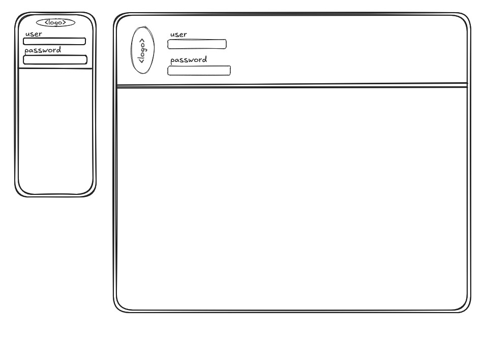
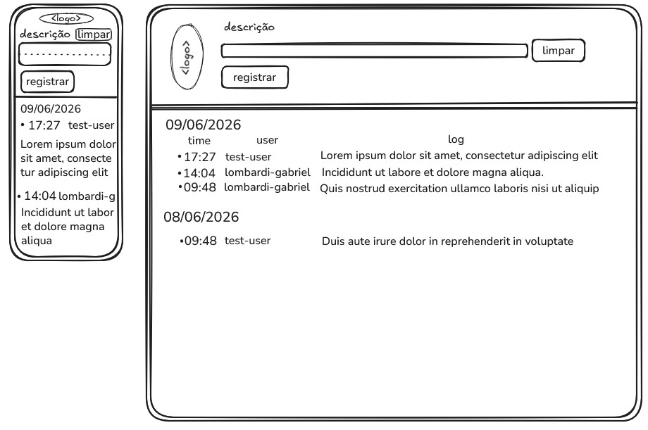
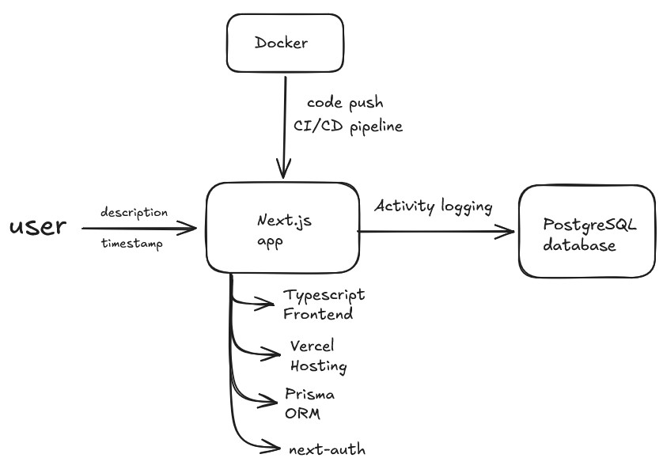

# Activity log app
This project is part of a selection process.
It consists of an activity log app with authentication, database updates and a cloud-hosted api.

> To get started, use these credentials

| username        | password           |
| ------------- |:-------------:|
| guest      | guest123 |

## Frontend
The initial idea consisted of an auth screen that validates users, which leads to production screen




## Architecture
This sketch demonstrates how to build and deploy the app, using free services while preparing for database scalability.



## API documentation

<details>
  <summary>Collapse to see the API documentation</summary>
  
  ### Activities
  Search information on logged activities
  #### GET
  
  Method: GET
  `/api?resource=activities`
  
  <br>Response sample

```json
  [{
  "description":"test log 1",
  "createdAt":"2026-06-09T16:10:09.000Z",
  "id":2,
  "userId":1
  }]
  ```
  #### POST
  Insert a new entry in the database by providing an Id and description
| Parameter        | requirement           |
| ------------- |:-------------:|
| Id      | required |
| Description| required   |

Method: POST
`/api?resource=activities`

body
```json
{
  "description": "[your text here]",
  "userId": 1,
  "startTime": "2026-06-09T09:00:00Z",
  "endTime": "2026-06-09T10:00:00Z"
}
```

<br> Response sample

```json
[{
  "description":"test log 2",
  "createdAt":"2026-06-09T17:25:19.000Z",
  "id":2,
  "userId":1,
  "endTime": 2026-06-09T13:00:00.000Z,
  "startTime": 2026-06-09T12:00:00.000Z
}]
```

  #### DELETE
  Delete an entry by providing an Id
| Parameter        | requirement           |
| ------------- |:-------------:|
| Id      | required |

Method: DELETE
`/api?resource=activities&id=$id`

Replace `$id` with the activity id

<br> Response sample

```json
"status": 200
[{
"message": "activity deleted",
}]
```
---
</details>

## Research done:

<details>
  <summary>List of documentations and articles</summary>

* https://nextjs.org/docs/app
    * setting up: https://nextjs.org/docs/app/api-reference/cli/create-next-app
    * API route: https://nextjs.org/docs/app/api-reference/functions/next-response
    * Layot and pages: https://nextjs.org/docs/app/getting-started/layouts-and-pages
* https://node-postgres.com/
    * https://node-postgres.com/apis/pool
* https://neon.com/docs
    * https://neon.com/docs/import/import-data-assistant
* https://www.reddit.com/r/Database/comments/1pfqlix/is_neontech_postgresql_good_for_small_startup/
* https://www.prisma.io/docs
    * https://www.prisma.io/docs/prisma-orm/quickstart/postgresql
* https://next-auth.js.org/getting-started/example
    * structure: https://next-auth.js.org/configuration/initialization
    * nextauth: https://next-auth.js.org/providers/credentials and https://next-auth.js.org/configuration/pages
    * middleware: https://next-auth.js.org/configuration/nextjs
    * middleware to proxy: https://nextjs.org/docs/messages/middleware-to-proxy
* https://docs.docker.com/reference/dockerfile
    * https://medium.com/@jaymesonmendes/setting-up-a-ci-cd-pipeline-with-github-actions-dockerhub-and-kubernetes-04b147867907
* https://docs.github.com/en/actions/reference/workflows-and-actions/workflow-syntax#jobsjob_iduses
    * https://medium.com/@jjzcru/building-a-ci-cd-pipeline-with-vercel-and-github-actions-f80d3a4a7de3
    * https://medium.com/@jaymesonmendes/setting-up-a-ci-cd-pipeline-with-github-actions-dockerhub-and-kubernetes-04b147867907 and https://github.com/docker/login-action
    * https://www.prisma.io/docs/orm/prisma-client/deployment/deploy-database-changes-with-prisma-migrate
* https://vercel.com/kb/guide/how-can-i-use-github-actions-with-vercel
* https://github.com/vercel/vercel/discussions/4307#discussioncomment-8888559

</details>

## Improvements

<details>
  <summary>Since the scope of this project is demonstrating my skills and thought processes, I'll leave the ideas I had of the next steps I would work on to develop this further.</summary>

* In production, passwords should be hashed using bcrypt
* Restrict POST and DELETE usage with tokens in endpoint
* UX: Add a sticky css so that scrolling doesn't hide the input section
* Add a dashboard page showing analytics
* Switch start date and end date to brazil format (dd/mm/yyyy)
* Block POST if startdate is equal or after end date
* A refresh feature to update multiple users logging at the same time
* createdAt timestamps are being kept in UTC timezone, not in GMT -3

</details>

## Final thoughts

This project was an interesting way of exploring a different typescript framework, new libraries, more tools, while bringing some of my previous knowledge to the mix.
It was a challenging way of learning, and delivering this in 48h was an engaging activity. I hope you enjoy!